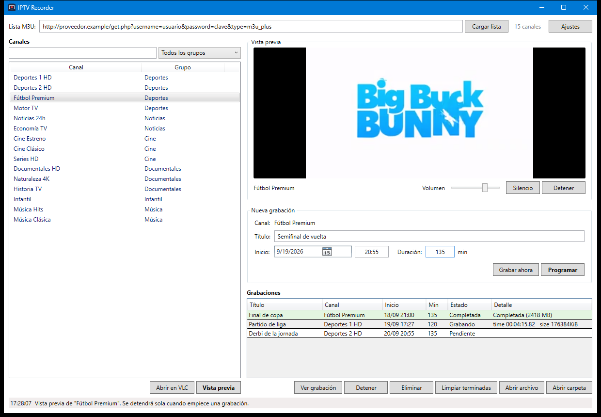
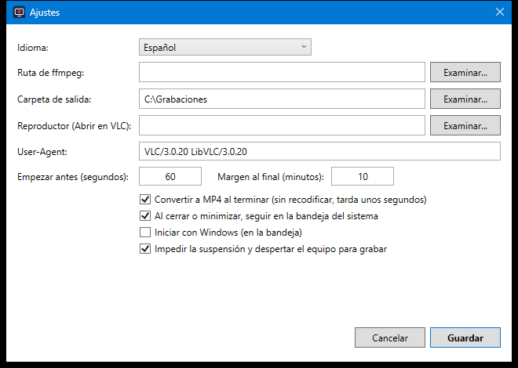

# IPTV Recorder

Grabador de canales IPTV para Windows. Carga una lista M3U, busca el canal y programa la grabación con fecha, hora y duración. La app lanza `ffmpeg` sola cuando llega la hora y guarda el resultado en MP4.



## Qué hace

- **Lista de canales** (izquierda): se carga desde el enlace M3U del proveedor y queda en caché. Búsqueda por nombre y filtro por grupo.
- **Vista previa** (arriba a la derecha): reproduce el canal dentro de la app antes de grabar, con volumen y silencio. "Abrir en VLC" lo abre en una ventana aparte.
- **Ver mientras se graba**: el botón "Ver grabación" muestra lo que se está grabando en ese momento. No abre una segunda conexión al proveedor, así que no interfiere con la grabación aunque tu servicio solo permita una conexión. Si ya estabas viendo el canal cuando arranca su grabación programada, la imagen vuelve sola a los pocos segundos.
- **Nueva grabación**: título, fecha, hora y duración. "Programar" la deja en cola; "Grabar ahora" empieza al momento.
- **Grabaciones**: estado en vivo de cada una. En la captura hay una completada, una en curso con tiempo y tamaño, y una pendiente para el día siguiente.
- **Bandeja del sistema**: al cerrar o minimizar la app sigue funcionando y las grabaciones programadas se hacen igualmente.



En **Ajustes** se elige el idioma (español o inglés), la carpeta de salida, si se convierte a MP4 al terminar, el margen de arranque antes de la hora, y si la app se inicia con Windows.

## Instalación

Descarga el zip de la [página de releases](https://github.com/oacevedo/iptv-recorder/releases), descomprímelo en cualquier carpeta y abre `IptvRecorder.exe`. No hace falta instalar nada más: el paquete incluye .NET, el motor de VLC y ffmpeg. Solo Windows 10/11 de 64 bits.

Si compilas desde el código fuente, necesitas el [SDK de .NET 10](https://dotnet.microsoft.com/download/dotnet/10.0) y `ffmpeg` en el PATH o indicado en Ajustes (`winget install ffmpeg`).

## Uso

1. Abre `IptvRecorder.exe`.
2. Pega el enlace M3U arriba y pulsa **Cargar lista**. La lista queda en caché, no hace falta volver a cargarla cada vez.
3. Busca el canal por nombre o filtra por grupo y selecciónalo.
4. Para comprobar que es el canal correcto, pulsa **Vista previa** (o doble clic en el canal). Se reproduce dentro de la app, en el panel superior derecho, con control de volumen y silencio. **Abrir en VLC** lo abre en una ventana aparte si prefieres pantalla completa. La app detiene la vista previa sola cuando empieza una grabación, para no ocupar la conexión del proveedor.
5. Rellena título, fecha, hora (formato 24h, por ejemplo `20:55`) y duración en minutos. Pon la duración del partido: la app añade sola el margen del final.
6. Pulsa **Programar**. O **Grabar ahora** para empezar al instante.

La app debe seguir abierta a la hora de la grabación. Al cerrarla o minimizarla se queda en la bandeja del sistema y las grabaciones se hacen igualmente. Para cerrarla del todo: clic derecho en el icono de la bandeja y **Salir**.

## Idioma

La interfaz está en español e inglés. Por defecto usa el idioma de Windows; se puede fijar en Ajustes y cambia al instante sin reiniciar.

Para añadir otro idioma: copia `Strings\Strings.en.xaml` como `Strings\Strings.xx.xaml` (código ISO de dos letras), traduce los textos y añade el idioma a la lista `Available` en `Localization.cs`.

## Ajustes

- **Idioma**: automático (el de Windows), español o inglés.

- **Carpeta de salida**: por defecto `Vídeos\IPTV`.
- **Reproductor**: el que se usa para "Abrir en VLC". Vacío significa VLC si está instalado, y si no, ffplay. La vista previa incrustada no depende de esto: usa LibVLC, que va incluido con la app.
- **Empezar antes**: segundos de margen antes de la hora indicada (por defecto 60) para que el stream enganche.
- **Margen al final**: minutos que se graban después de la hora de fin (por defecto 10), para que los descuentos y las prórrogas no corten el partido. Pon 0 para desactivarlo.
- **Convertir a MP4**: al terminar, remuxea el `.ts` a `.mp4` sin recodificar y borra el `.ts`.
- **Iniciar con Windows**: arranca minimizado en la bandeja al iniciar sesión, para no perder grabaciones.
- **Impedir la suspensión**: bloquea la suspensión mientras se graba y despierta el equipo antes de una grabación programada. Activado por defecto.
- **User-Agent**: algunos proveedores solo aceptan reproductores conocidos. Por defecto se identifica como VLC.

## Limitaciones

- Casi todos los proveedores limitan las conexiones simultáneas. Una grabación cuenta como una conexión: no veas **otro** canal del mismo servicio mientras grabas. Ver la propia grabación con "Ver grabación" sí es seguro, porque no abre ninguna conexión adicional.
- La app impide que el equipo se suspenda mientras graba y lo despierta para las grabaciones programadas, pero no puede encenderlo si está apagado del todo. Algunos planes de energía tienen desactivados los temporizadores de reactivación; en ese caso la app lo avisa en la barra de estado.
- Las URLs de la lista cambian a veces. Si una grabación falla con error de conexión, vuelve a cargar la lista y programa de nuevo.

## Compilar

```powershell
.\build.ps1      # compilación para desarrollo en dist\ (requiere el runtime de .NET 10)
.\release.ps1    # paquete autocontenido para distribuir en release\*.zip
```

`dist` contiene el ejecutable y la carpeta `libvlc` con el motor de VLC para la vista previa. Hay que copiar las dos cosas juntas.

## Créditos

- [FFmpeg](https://ffmpeg.org) (build de [gyan.dev](https://www.gyan.dev/ffmpeg/builds/)), licencia GPL.
- [LibVLC](https://www.videolan.org/vlc/libvlc.html) y [LibVLCSharp](https://code.videolan.org/videolan/LibVLCSharp), licencia LGPL.

## Datos

Ajustes, grabaciones programadas y caché de la lista se guardan en `%APPDATA%\IptvRecorder`.
